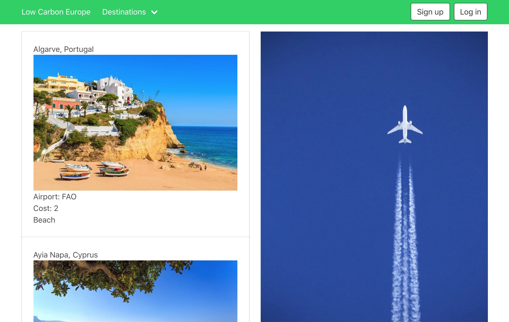

# GA Project 4: Low Carbon Travel - A Django and React stack app 



### Link

[Low Carbon Travel](https://project-4-destinations.herokuapp.com/#/)

### Installation 

Fork the repository

Clone the repository down to your local system

Install pipenv in the terminal: *pip install pipenv*

Run pipenv in your local repository: *pipenv shell*

Run *yarn* in the terminal to install dependencies

### Brief

Working individually, I was tasked with building a full-stack application using a Python Django API, with Django REST Framework to serve data from an SQLite database, and consuming this with a separate front-end built in React. 

Key deliverables were as follows:

* Build a full-stack Python Django API and React application
* Be a complete product, requiring multiple relationships and Create Read Update and Delete (CRUD)  functionality for at least two models
* Have a visually impressive design
* Be deployed online
* Have automated tests for at least one RESTful resources on the back-end

### Technologies used

Django, Python, SQLite, React, JavaScript, Axios, Bulma, HTML5, ES6, CSS 3, SASS, Yarn, pipenv, Git, Github

### Timeframe

7 days

### Overview & concept of the project

Having worked in groups for projects 2 and 3, I decided to tackle this project as a solo one, to help reinforce the full range of techniques I had learned already throughout the course.

I took time to decide on a concept, considering several possibilities (such as a London historic buildings finder) before settling on a holiday destination app. This offered the opportunity to have visually attractive content, together with allowing me to focus on the technical aspects by having a clear and simple idea for the content. 

In order to give this a unique selling point, I decided to focus on the emerging trend for lower carbon holidays, and as such I decided to investigate 3rd party APIs for calculating the carbon of trips. 

A mobile-first design approach was also a goal from the outset, having not had the opportunity in my previous projects to truly pursue this. My design thinking has continued to evolve towards a "less is more" approach, and I wanted to have a very clean design which was truly easy to use on mobile.

I also decided to minimise features in order to maximise the continuity of design across the site, given the timeframes in question. As discussed below, timeframes still proved to be an issue, but I consider this approach was correct in any event. 

### Approach taken

## Planning

I took time to plan the user story for the site, deciding that the user would want a simple search functionality to allow them to almost immediately start browsing holiday destinations, together with the more complex CRUD functionality once they were registered and logged in. 

I therefore centered the model design on the destination, with a many-to-one relationship between the in-built Django user model and the destination (noting that Django does not actually provide for a one-to-many relationship). I also added a further category model in a many-to-many relationship with the destination model, in order to facilitate better grouping and searching of the destinations. I spent a good amount of time researching Entity Relationship Diagrams for planning out table relationships in relational databases such as SQLite, which was a considerable difference to my previous experience with the NoSQL MongoDB.

For page design, I wanted simple effective navigation, and decided early on against having an index page of all available holidays, to then be filtered down. I wanted the use to proactively enter their requirements before seeing any results; as such I designed the search page to request key information, which the user then has to submit before returning results. Having used as-you-type dynamic filtering on my previous projects, I feel that using a form to submit information, which not necessarily looking as impressive, is often a better design solution. 

For index and show, given the mobile first approach, I wanted simple, consistently formatted text and pictures which displayed well on mobile. I decided to use Bulma to achieve this, given its in-built responsiveness and excellent formatting and spacing qualities. It also saved time, which on a time limited project like this was a real consideration. 

In order to manage the workflow of the project, I set up a Trello board with cards for discrete tasks. Unlike in previous projects I did not mark these individually using the MoSCoW methodology, as the cards represented the MVP of the project. This is discussed further in the learning points section below.

My research into 3rd party APIs led me to [CarbonKit.net](https://docs.carbonkit.net/), which has an excellently documented API for a whole range of carbon calculators. I decided to use their Great Circle flight methodology model which calculates the carbon for a flight between two airports, as it would allow the user to enter an easy input (the IATA code for an airport) and be returned a unique calculaton of the carbon of their trip.

## Implementation

I commenced the project by setting up the requisite Git and Github, before moving onto the backend setup with Django. 

### Django Setup

I previously found the Model-Template-View framework of Django a little confusing, coming from the Model-View-Controller design pattern of Express, so I took my time to understand the conceptual differences, as well as the similarities. 

Having done so, I created the Django project folder, and then the destinations app within this to contain the required Django back-end content. 

I started the project using the Django Rest Framework (DRF) generic views for full REST functionality, however removed these later on when they could not provide the flexibility I required around nesting models within models. 

Nesting became a recurring problem during the implementation of the Django back-end, with problems with recursion in the serialisers when looking to nest the destinations in the user AND the user in the destinations (similarly for categories and holidays. As such, I ended up implementing different serialisers for the same models based on whether these needed to be populated with the nested models, if so ensuring there was not infinite recursion. Similarly, different serializers are used in the different views based on the RESTful route in question:

```Python

# views.py extract

 class DestinationList(APIView):

    def get(self, _request):
        destinations = Destination.objects.all()
        serializer = PopulatedDestinationSerializer(destinations, many=True)
        return Response(serializer.data)

    def post(self, request):
        serializer = DestinationSerializer(data=request.data)
        if serializer.is_valid():
            serializer.save(user=request.user)
            destination = serializer.instance
            serializer = PopulatedDestinationSerializer(destination)
            return Response(serializer.data, status=HTTP_201_CREATED)

        return Response(serializer.errors, status=HTTP_422_UNPROCESSABLE_ENTITY)
        
================================================
#serialisers.py extract

 class DestinationSerializer(serializers.ModelSerializer):
    user = UserSerializer(read_only=True)

    class Meta:
        model = Destination
        fields = ('id', 'name', 'airport', 'country', 'longitude', 'latitude', 'cost', 'image', 'description', 'user', 'categories',)

class PopulatedDestinationSerializer(serializers.ModelSerializer):

    categories = CategorySerializer(many=True, read_only=True)

    class Meta(DestinationSerializer.Meta):
        fields = ('id', 'name', 'airport', 'country', 'longitude', 'latitude', 'cost', 'image', 'description', 'categories', 'user',)
```

Once the models, views and serialisers were implemented, I then proceeded to populate the database with test data and users, using the in-built Django site administration tools and the DRF to test the back-end setup. Having to migrate when making changes to the models was a new feature compared to Express and unexpectedly time consuming when this effectively resulted in having to reseed the data; as such I found the use of a fixtures json file early on of great assistance. 

Authentication is handled using JSON Web Token (JWT), not supported out of the box by Django, so I wrote a new app to handle authentication, hooked into the main project settings.py, and custom serialisers and views to handle user registration and login. Unsafe access to destinations for users that do not own a record is currently prevented through the front-end and the hiding of the links to these features if a user is not authenticated or is authenticated but does not match the create user. While this works for now, adding in the built in permissions from Django REST Framework on the back end is a to-do for the app to provide proper CRUD control.


### React Setup

Having the back-end functioning and accessible through the built-in features Django and DRF, I then proceeded to hook this up to the React front end, using a separate front-end app. The project urls point to the front-end app, which in turn opens the index.html and loads the React route DOM node. This is one aspect of the project I intent to research further, as while I understand the concept of the various steps undertaken to link React to the back-end, I am uncertain over the actual implementation in places.

For the implementation of the React front-end, I built on my existing experience using components such as react-select, and the styling framework Bulma to add additional functionality and a consistent styling across the site, while avoiding a "fussy" screen with too much content and always keeping a mobile-first design approach. 

### User experience and forms

Error handling and form guidance was something I found myself focusing on in the design, as part of my desire to have a clear user experience. I also concentrated on data validation, using both back-end and front-end methods to ensure that the user could only enter valid data, and was aware of what the requirements were. 

In particular, in researching good front-end form design was extremely interested in this article:

[Don't Use the Placeholder Attribute](https://www.smashingmagazine.com/2018/06/placeholder-attribute/)

regarding placeholder text, which influenced my decision to remove placeholders and replace them with help paragraph classes, with aria-describedby used for screenreader support for the required input. I also ensured that the form labels and inputs were correctly associated, using htmlFor and id.

Examples:

```Python

# models.py - use of model validators

from django.core.validators import RegexValidator

alphanumeric = RegexValidator(r'^[A-Z]*$', 'Only capital letters are allowed.')

airport = models.CharField(max_length=3, null=True, validators=[alphanumeric])

```
==========================================================================

```Javascript
# DestinationNew.js - input validation

<div className="field">
     <label className="label" htmlFor="airport">Airport</label>
     <p className="help" id="airport-hint"> Enter the IATA airport code, e.g. LAX for Los Angeles International
     </p>
     <div className="control">
       <input
         id="airport"
         aria-describedby="airport-hints"
         className="input is-uppercase"
         maxLength="3"
         name="airport"
         onChange={this.handleChangeAirport}
       />
     </div>
     {this.state.errors.airport && <small className="help is-danger">{this.state.errors.airport}</small>}
 </div>
 
 ==============
 
 # DestinationSearch.js - button disabling until inputs entered
 
const isEnabled = categories.length > 0 && cost !== '' && airport !== ''

<button className="button" type="submit" disabled={!isEnabled}>Go!</button>
```

### CarbonKit API

The CarbonKit API model chosen requires a GET request containing the two IATA airport codes, which will return a range of values relating to carbon and other emissions that can then be displayed to the user. Originally I had intended for this to show on the index page of the destinations after a user had searched, and enable sorting by lowest amount, however this quickly proved complex involve batch requests for multiple airports and issue around the sequencing of axios requests. 

As such, I reversed this approach and decided to make the request on the show page for individual destination, the correct decision in my view given the timeframe of the project. The search airport is fed through to the show page using params, the destination airport extracted from the destination response, these passed to the API and the result displayed:

```Python
componentDidMount(){

    return axios.get(`/api/destinations/${this.props.match.params.id}`)
      .then(res => {
        const airport = res.data.airport
        return axios.get('/api/carbonkit', {
          params: {
            'values.IATAcode1': this.props.match.params.airport,
            'values.IATAcode2': airport
          }
        })
          .then(carbonRes => {
            res.data.carbon = Math.round(carbonRes.data.output.amounts[1].value)

            this.setState({
              destination: res.data
            })
          })

      })
  }
```

### Styling

I used vanilla Bulma styling for the site, given a coherent, modern overall look in an efficient amount of time. The clear, bold styling is intended to present the user with only the information they require, and minimises general screen clutter. The mobile-first approach works well with this type of design, with responsiveness added in for tablet and desktop sizes but with the primary focus on clean, clear mobile experience.  

The project logo (placed in the Navbar) unfortunately suffered an encoding issue when deploying to Heroku, which proved tricky to solve and is a current outstanding issue. This detracts more significantly from the design than I had anticipated, but is a good lesson in how apparently small changes to design can have a major impact, especially on websites with an intentionally minimal feel. 

### Finished product

I am extremely happy with the app as finished. Not only was this built with technologies some of which I had only been introduced to two weeks beforehand, but the overall consistency of the design and functionality (especially on the inputs) was a core goal which I feel I achieved.  

### Wins and Blockers

#### Wins:
* The design of the input pages, their usability and error reporting. 

* The use of a third party API in a considered and practical way, which enhances the user experience and gives the app something unique.

#### Blockers:

* Making batch requests to CarbonKit to enable a more effective comparison of destination by carbon output. 

* An encoding issue with the site logo on deployment to Heroku


### Future features

* Comparison of destinations by carbon / calculation of carbon savings between destinations

* CRUD authentication with Django permissions, currently handled through front-end button display which is not ideal. 
* More destination data
* Automated testing


### Learning points
----
#### Methodology
Taking on a full stack project on my own was enjoyable, however delivering MVP in the timeframe allocated proved a challenge. As such, I ended the week period with a proof of concept product which I then tailored over the next several weeks to the fully fledged app. 

This was an excellent reminder that planning adequate contingency time into a project is key, together with having a simple MVP which can then be built upon later. My original MVP for the project, which I felt was the most basic possible, could have been stripped down further to deliver a full, if basic app within the week timeframe. 

Planning the relationships in a relational database was a new and interesting challenge, and reading around this and ERD usage was a worthwhile exercise.

#### Technical
The big technical challenge in the project I found  was moving from the Express MVC to the Django MTV design pattern, which led to the back-end design taking longer than I had anticipated. Furthermore, changes to this were not as intuitive as with Express, which added further time to the back end design. 


